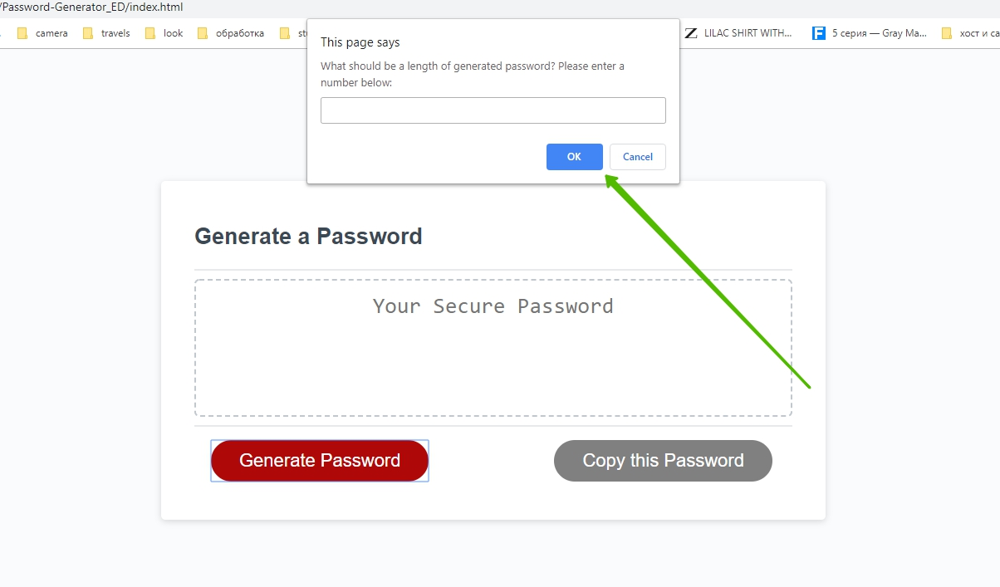
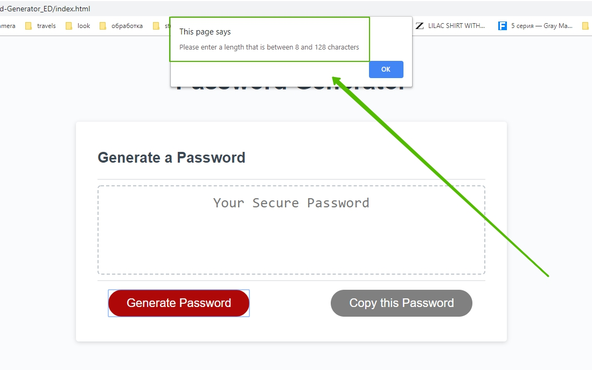
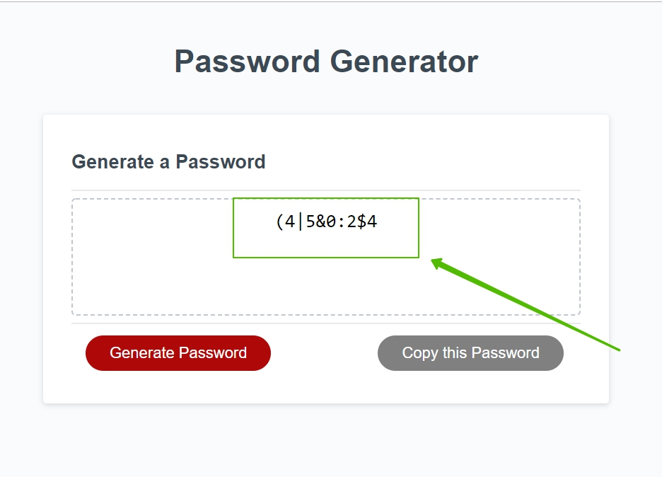
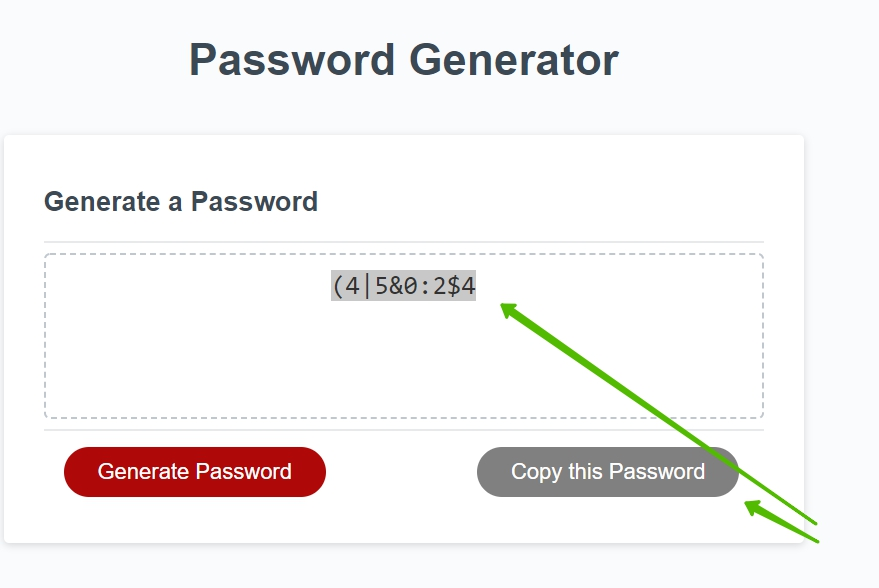

This small application will help you create a new strong password with your criterias! 
To start your Password Generator press "Generate Password" button. 
Now it's time to set your criterias! 
First criteria : the length of you future password  
The pop-up message will ask you to enter a wanted lenght  
 
Ooops.. 
 
OOps! I'm sorry if you got this message. There is a certain interval of a generated password , and it's between 8 and 128 characters. Please enter some number that satisfies this interval. Please contact me if you need longer password, I will edit my code application for your preferences)  
Now that you got your length you will be asking about certain character type that you would like to include in your password. Please press "Ok" if you want this specific character, and "Cancel" if you don't want it. 
There are four of character type for your choice.  
After you have made your mind with the character type you will immediately see your generated password in a window! 
Here is some example of Generated password :   
 
This password is 10 characters length and includes Special and NUmeric characters.
After your password has been generadet you will be able to copy it with a "Copy Password" buttun to a clipboard. 
  
You got this!  
If you want to generate a new password just press the "Generate Password " button again. 

Thank you for choosing my application ! Have fun with it !  

PS. Here is a link to the deployed GitHub Pages  
<a href ="https://ellen0404.github.io/Password-Generator_ED/">Link to my Application</a>

